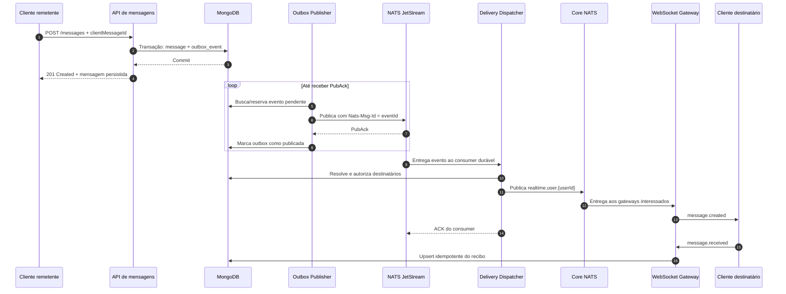

# Guia de implementação — envio e entrega de mensagens

## 1. Objetivo

Este documento define a arquitetura para criar, persistir, publicar e entregar mensagens em tempo real usando:

- MongoDB como fonte de verdade das mensagens;
- Transactional Outbox para impedir que uma mensagem salva deixe de ser publicada;
- NATS JetStream para persistência e reentrega dos eventos;
- Core NATS para roteamento em tempo real até as instâncias WebSocket;
- WebSocket para comunicação entre o backend e os clientes conectados;
- idempotência em todas as fronteiras sujeitas a retry;
- sincronização pelo banco para recuperar mensagens após desconexões.

O objetivo não é prometer entrega "exatamente uma vez". A garantia adotada é:

> entrega pelo menos uma vez, com processamento idempotente e recuperação pelo banco.

Isso significa que uma mensagem pode atravessar alguma etapa mais de uma vez, mas não deve ser criada nem exibida em duplicidade.

---

## 2. Garantias e limites

### 2.1 O que a arquitetura garante

- Uma mensagem confirmada pela API foi persistida no banco.
- Toda mensagem persistida possui um evento de outbox criado na mesma transação.
- Eventos não publicados são tentados novamente até receberem confirmação do JetStream.
- Eventos não confirmados pelo consumer do JetStream são entregues novamente.
- Repetições da requisição, publicação, consumo ou confirmação não duplicam o efeito lógico.
- Um cliente que ficou offline consegue recuperar mensagens consultando a timeline.
- O estado `delivered` somente é registrado após um ACK explícito da aplicação cliente.

### 2.2 O que não deve ser prometido

- Um `PubAck` do JetStream não significa que o destinatário recebeu a mensagem.
- Um ACK do consumer não significa que o cliente recebeu a mensagem.
- Escrever no socket não prova que a aplicação cliente processou o frame.
- WebSocket isoladamente não é um mecanismo durável.
- O sistema não oferece entrega exatamente uma vez de ponta a ponta.

### 2.3 Significado de cada confirmação

| Confirmação | Garantia |
| --- | --- |
| Commit da transação MongoDB | Mensagem e evento de outbox foram persistidos. |
| `PubAck` do JetStream | O evento foi armazenado no stream. |
| ACK do consumer JetStream | O dispatcher terminou o processamento definido para o evento. |
| Escrita concluída no WebSocket | O gateway aceitou os bytes para envio. |
| `message.received` do cliente | A aplicação cliente recebeu e processou a mensagem. |
| `message.read` do cliente | O usuário visualizou a mensagem segundo a regra do produto. |

---

## 3. Componentes

| Componente | Responsabilidade |
| --- | --- |
| API de mensagens | Autenticar, autorizar, validar e persistir a mensagem e a outbox. |
| MongoDB | Fonte de verdade de mensagens, outbox, recibos e cursores de ordenação. |
| Outbox Publisher | Publicar eventos pendentes no JetStream e aplicar retry. |
| JetStream | Armazenar eventos e entregá-los de forma durável ao dispatcher. |
| Delivery Dispatcher | Consumir eventos, resolver destinatários e publicar eventos em tempo real. |
| Core NATS | Distribuir eventos efêmeros aos gateways que possuem conexões interessadas. |
| WebSocket Gateway | Manter conexões, autenticar sessões e fazer fan-out local. |
| Cliente | Deduplicar mensagens, manter cursor e enviar ACKs de recebimento e leitura. |

O navegador não deve ter acesso direto ao NATS. Ele se conecta somente ao WebSocket da aplicação. Dessa forma, autorização, formato dos frames e acesso aos subjects continuam sob controle do backend.

---

## 4. Fluxo completo



### 4.1 Caminho durável e caminho em tempo real

O fluxo possui dois caminhos com responsabilidades diferentes:

- **Caminho durável:** MongoDB → Outbox → JetStream. Garante que o evento não seja perdido por falhas intermediárias.
- **Caminho em tempo real:** Delivery Dispatcher → Core NATS → WebSocket. Reduz a latência para usuários conectados.

Se o caminho em tempo real falhar ou o usuário estiver offline, a mensagem não é perdida porque já está no MongoDB. O cliente a recupera ao sincronizar a timeline.

---

## 5. Etapa 1 — criação da mensagem

### 5.1 Contrato HTTP recomendado

```http
POST /v1/chats/{chatId}/messages
Content-Type: application/json
```

```json
{
  "clientMessageId": "018f92d4-2c47-7c87-b33e-d2ea331d2ff2",
  "content": {
    "type": "TEXT",
    "value": "Olá!"
  }
}
```

`clientMessageId` é gerado uma única vez pelo cliente e reutilizado em todas as tentativas da mesma mensagem.

O usuário autenticado e o `senderId` nunca devem ser aceitos do corpo. Eles são obtidos da sessão.

### 5.2 Validações

Antes da transação, a API deve:

1. autenticar a sessão;
2. validar o formato do `chatId`;
3. validar `clientMessageId`;
4. validar o tipo e o tamanho do conteúdo;
5. confirmar que o usuário participa do chat;
6. aplicar limites de frequência e tamanho;
7. rejeitar campos desconhecidos.

### 5.3 Idempotência da requisição

Crie um índice único para impedir duas mensagens lógicas iguais do mesmo remetente:

```text
UNIQUE(sender_id, client_message_id)
```

Ao receber novamente o mesmo par:

- se o conteúdo for igual, retorne a mensagem já criada;
- se o conteúdo for diferente, retorne `409 idempotency_conflict`;
- não crie um segundo item na timeline;
- não crie um segundo evento lógico de outbox.

Uma resposta repetida pode usar `200 OK`; a criação original usa `201 Created`.

### 5.4 Ordenação

Cada mensagem deve possuir uma ordenação estável dentro do chat. A opção recomendada é adicionar `sequence`, crescente por chat:

```json
{
  "sequence": 183
}
```

Crie o índice:

```text
UNIQUE(chat_id, sequence)
```

O `sequence` é a referência para:

- ordenar mensagens recebidas fora de ordem;
- identificar lacunas;
- sincronizar após reconexão;
- ignorar mensagens antigas.

Se a primeira versão não adotar `sequence`, use o par `(created_at, _id)` como cursor determinístico, mantendo o mesmo critério em todas as consultas. O campo `sequence` é preferível para o protocolo em tempo real.

### 5.5 Transação MongoDB

A criação da mensagem e da outbox deve ocorrer na mesma transação:

```text
BEGIN TRANSACTION

1. Alocar o próximo sequence do chat.
2. Inserir timeline_items.
3. Atualizar chats.summary_sort_at.
4. Inserir outbox_events com status PENDING.

COMMIT
```

Se qualquer operação falhar, toda a transação deve ser revertida.

Transações MongoDB exigem replica set ou cluster fragmentado. O ambiente local também deve iniciar o MongoDB como replica set para exercitar o mesmo comportamento da produção.

### 5.6 Documento da mensagem

Exemplo compatível com a coleção `timeline_items` já definida no projeto:

```json
{
  "_id": "6ab85d4aa94d3539db5a83a6",
  "chat_id": "6ab85d4aa94d3539db5a83a0",
  "sequence": 183,
  "kind": "MESSAGE",
  "created_at": "2026-09-29T12:00:00.000Z",
  "updated_at": "2026-09-29T12:00:00.000Z",
  "message": {
    "client_message_id": "018f92d4-2c47-7c87-b33e-d2ea331d2ff2",
    "sender_id": "6a7521f266ec07731754f78e",
    "content": {
      "type": "TEXT",
      "value": "Olá!"
    }
  }
}
```

### 5.7 Documento da outbox

```json
{
  "_id": "event-uuid",
  "aggregate_type": "CHAT",
  "aggregate_id": "6ab85d4aa94d3539db5a83a0",
  "event_type": "chat.message.created.v1",
  "payload": {
    "messageId": "6ab85d4aa94d3539db5a83a6",
    "chatId": "6ab85d4aa94d3539db5a83a0",
    "sequence": 183,
    "senderId": "6a7521f266ec07731754f78e",
    "content": {
      "type": "TEXT",
      "value": "Olá!"
    },
    "createdAt": "2026-09-29T12:00:00.000Z"
  },
  "status": "PENDING",
  "attempts": 0,
  "next_attempt_at": "2026-09-29T12:00:00.000Z",
  "locked_by": null,
  "locked_until": null,
  "published_at": null,
  "last_error": null,
  "created_at": "2026-09-29T12:00:00.000Z"
}
```

O payload da outbox deve ser suficiente para publicar o evento, mas não deve conter tokens, cookies ou outros segredos.

### 5.8 Resposta da API

A API responde somente depois do commit:

```http
HTTP/1.1 201 Created
```

```json
{
  "data": {
    "id": "6ab85d4aa94d3539db5a83a6",
    "clientMessageId": "018f92d4-2c47-7c87-b33e-d2ea331d2ff2",
    "chatId": "6ab85d4aa94d3539db5a83a0",
    "sequence": 183,
    "senderId": "6a7521f266ec07731754f78e",
    "content": {
      "type": "TEXT",
      "value": "Olá!"
    },
    "createdAt": "2026-09-29T12:00:00.000Z",
    "deliveryStatus": "PERSISTED"
  }
}
```

`PERSISTED` significa apenas que o banco confirmou a mensagem. Não significa que o destinatário a recebeu.

---

## 6. Etapa 2 — publicação da outbox no JetStream

### 6.1 Reserva concorrente

Pode haver várias instâncias do Outbox Publisher. Cada evento deve ser reservado atomicamente usando `findOneAndUpdate` ou operação equivalente:

```text
Filtro:
  status em [PENDING, PROCESSING]
  published_at ausente
  next_attempt_at <= now
  locked_until ausente ou < now

Atualização:
  status = PROCESSING
  locked_by = instanceId
  locked_until = now + leaseDuration
```

A reserva deve ter prazo. Se uma instância cair, outra poderá processar o evento após `locked_until` expirar.

Um evento em `PROCESSING` com lease expirado deve ser elegível para nova reserva. Alternativamente, uma rotina de recuperação pode devolvê-lo a `PENDING`; não use um filtro que considere apenas `PENDING`, pois isso deixaria eventos abandonados após a queda de um worker.

### 6.2 Publicação

Configuração lógica:

```text
Stream: CHAT_EVENTS
Subject: chat.message.created.<partition>
Header Nats-Msg-Id: <outbox_event_id>
```

A partição pode ser calculada por:

```text
hash(chatId) % totalPartitions
```

Isso mantém mensagens do mesmo chat na mesma partição. Mesmo assim, a ordenação definitiva continua sendo o `sequence` persistido no banco.

### 6.3 Confirmação

O publisher deve:

1. publicar o evento;
2. aguardar o `PubAck` do JetStream;
3. somente então marcar a outbox como `PUBLISHED`;
4. salvar `published_at` e os metadados retornados pelo JetStream.

Se o processo cair após o `PubAck`, mas antes de atualizar o MongoDB, o evento será publicado novamente. Esse comportamento é esperado e deve ser neutralizado pela deduplicação.

### 6.4 Retry

Em falhas transitórias:

- incrementar `attempts`;
- registrar um erro sanitizado em `last_error`;
- retornar o status para `PENDING`;
- calcular `next_attempt_at` com exponential backoff e jitter;
- renovar ou liberar o lease adequadamente.

Exemplo de sequência de retry:

```text
1 s, 2 s, 5 s, 10 s, 30 s, 1 min, 5 min
```

Não exclua automaticamente o evento depois de um número pequeno de falhas. Uma indisponibilidade prolongada do NATS não deve transformar mensagens persistidas em mensagens esquecidas. Eventos permanentemente inválidos devem ir para análise operacional.

### 6.5 Limpeza da outbox

Eventos `PUBLISHED` podem ser removidos por uma rotina de retenção, por exemplo após 7 ou 30 dias. A remoção deve considerar as necessidades de auditoria e diagnóstico.

Índices recomendados:

```text
(status, next_attempt_at)
(locked_until)
(published_at) com TTL, se a política permitir
```

---

## 7. Etapa 3 — configuração do JetStream

### 7.1 Stream

Configuração inicial recomendada:

| Opção | Valor inicial | Motivo |
| --- | --- | --- |
| Nome | `CHAT_EVENTS` | Identificação operacional. |
| Subjects | `chat.message.>` | Eventos de mensagens. |
| Storage | `FileStorage` | Persistência em disco. |
| Replicas | `3` em produção | Tolerância à perda de nó. |
| Retention | `LimitsPolicy` | Permite múltiplos consumidores independentes. |
| Discard | `DiscardOld` | Remove eventos antigos conforme limites. |
| MaxAge | 3 a 7 dias inicialmente | Cobre indisponibilidades e replay operacional. |
| Duplicate window | Dimensionada para retries comuns | Reduz publicações duplicadas próximas. |

Os limites de bytes e mensagens devem ser definidos a partir do volume esperado e monitorados. Não deixe o armazenamento crescer sem limite.

### 7.2 Consumer de entrega

Configuração lógica:

```text
Durable name: MESSAGE_DELIVERY
Filter subject: chat.message.created.>
Mode: pull
Ack policy: explicit
Deliver policy: all
Ack wait: maior que o tempo máximo normal de processamento
Max ack pending: limitado conforme capacidade
Max deliver: definido com política de falha permanente
Backoff: configurado para falhas transitórias
```

Consumers pull facilitam controle de lote, concorrência e backpressure.

### 7.3 Segurança

Use credenciais distintas e permissões mínimas:

- API não precisa consumir o stream;
- Outbox Publisher publica somente em `chat.message.created.>`;
- Delivery Dispatcher consome somente o consumer esperado e publica em `realtime.user.>`;
- WebSocket Gateways assinam `realtime.user.>`, mas não publicam eventos de domínio arbitrários;
- conexões NATS usam TLS;
- dados sensíveis em disco devem seguir a política de criptografia da infraestrutura.

---

## 8. Etapa 4 — consumo e despacho

### 8.1 Processamento do evento

Para cada mensagem recebida do JetStream, o Delivery Dispatcher deve:

1. validar o envelope e a versão do evento;
2. validar os identificadores obrigatórios;
3. consultar o chat e resolver os destinatários atuais;
4. nunca confiar em uma lista de destinatários enviada pelo cliente;
5. gerar o evento público de tempo real;
6. publicar uma cópia para cada usuário destinatário;
7. confirmar a mensagem do JetStream depois de concluir o despacho definido.

Em um chat direto, o destinatário normalmente é o outro participante. Em grupos, todos os membros elegíveis são destinatários, respeitando saídas, bloqueios e regras vigentes no momento definido pelo domínio.

### 8.2 Evento de tempo real

Subject:

```text
realtime.user.<userId>
```

Payload:

```json
{
  "type": "message.created",
  "eventId": "event-uuid",
  "occurredAt": "2026-09-29T12:00:00.000Z",
  "data": {
    "id": "6ab85d4aa94d3539db5a83a6",
    "chatId": "6ab85d4aa94d3539db5a83a0",
    "sequence": 183,
    "senderId": "6a7521f266ec07731754f78e",
    "content": {
      "type": "TEXT",
      "value": "Olá!"
    },
    "createdAt": "2026-09-29T12:00:00.000Z"
  }
}
```

O cliente deduplica por `data.id`; `eventId` identifica a ocorrência do evento.

### 8.3 ACK, NAK e falha permanente

- Use ACK quando o evento foi validado e publicado no caminho de tempo real.
- Use NAK ou deixe o `AckWait` expirar em falhas transitórias.
- Use um atraso crescente entre novas tentativas.
- Para payload incompatível ou corrompido, publique um evento sanitizado em `chat.message.delivery_failed`, registre a falha e finalize a mensagem original para evitar loop infinito.

O ACK após publicar em Core NATS não afirma que havia um usuário conectado. Ele afirma apenas que o dispatcher concluiu seu trabalho. A durabilidade para usuários offline vem do MongoDB e da sincronização posterior.

### 8.4 Idempotência do consumer

O consumer pode receber o mesmo evento novamente. Portanto:

- qualquer escrita adicional deve usar upsert ou índice único;
- notificações push devem possuir sua própria chave idempotente;
- o cliente deve deduplicar mensagens pelo `messageId`;
- nenhum contador pode ser incrementado cegamente em uma reentrega.

Caso seja necessário registrar processamento, use uma coleção com índice único em `(consumer_name, event_id)`.

---

## 9. Etapa 5 — entrega pelos gateways WebSocket

### 9.1 Autenticação da conexão

No handshake, o gateway deve:

1. validar a sessão usando o mesmo modelo de autenticação HTTP;
2. obter o `userId` exclusivamente da sessão;
3. rejeitar sessões expiradas ou revogadas;
4. associar a conexão ao usuário autenticado;
5. nunca permitir que o cliente escolha um subject NATS.

### 9.2 Assinaturas no Core NATS

Cada gateway assina os usuários que possuem pelo menos uma conexão local:

```text
realtime.user.<userId>
```

Não use queue group entre gateways para esses subjects. Com queue group, apenas uma instância receberia o evento, e ela pode não possuir todas as conexões daquele usuário.

Com pub/sub normal:

- todos os gateways que possuem o usuário recebem o evento;
- cada gateway distribui para as conexões locais daquele usuário;
- múltiplas abas ou dispositivos podem receber a mesma mensagem.

Para reduzir o número de assinaturas NATS em escala muito alta, uma evolução possível é rotear por gateway ou por partição, apoiado por um registro de presença. Essa complexidade não é necessária na primeira implementação.

### 9.3 Frame enviado ao cliente

```json
{
  "type": "message.created",
  "eventId": "event-uuid",
  "data": {
    "id": "6ab85d4aa94d3539db5a83a6",
    "chatId": "6ab85d4aa94d3539db5a83a0",
    "sequence": 183,
    "senderId": "6a7521f266ec07731754f78e",
    "content": {
      "type": "TEXT",
      "value": "Olá!"
    },
    "createdAt": "2026-09-29T12:00:00.000Z"
  }
}
```

### 9.4 Backpressure e conexões lentas

Cada conexão deve possuir uma fila de saída limitada. Quando o limite for excedido:

1. não permita crescimento ilimitado em memória;
2. encerre a conexão lenta com um código apropriado;
3. registre a métrica e o motivo;
4. deixe o cliente reconectar e sincronizar pelo banco.

Implemente ping/pong e prazo de inatividade para remover conexões mortas.

---

## 10. Etapa 6 — ACK do cliente e recibos

### 10.1 ACK de recebimento

Depois de validar e incorporar a mensagem ao estado local, o cliente envia:

```json
{
  "type": "message.received",
  "data": {
    "messageId": "6ab85d4aa94d3539db5a83a6"
  }
}
```

O gateway valida que:

- a conexão está autenticada;
- o usuário é destinatário da mensagem;
- o `messageId` existe;
- o estado solicitado é permitido.

### 10.2 Persistência do recibo

Exemplo de documento:

```json
{
  "message_id": "6ab85d4aa94d3539db5a83a6",
  "recipient_id": "6a7521f266ec07731754f78f",
  "delivered_at": "2026-09-29T12:00:00.350Z",
  "read_at": null,
  "updated_at": "2026-09-29T12:00:00.350Z"
}
```

Índice obrigatório:

```text
UNIQUE(message_id, recipient_id)
```

O update deve ser monotônico e idempotente:

- não apagar datas já registradas;
- manter a primeira `delivered_at`, salvo se o produto definir outra semântica;
- `read_at` implica que a mensagem também foi entregue;
- repetir o mesmo ACK não altera o resultado.

### 10.3 Entregue versus lida

- `delivered_at`: ao menos uma sessão válida do destinatário confirmou o recebimento.
- `read_at`: o cliente informou que a mensagem entrou na área considerada visível/lida.

Defina se esses estados são por usuário ou por dispositivo. Para a maioria dos chats, recibo por usuário é suficiente. Recibo por dispositivo exige incluir `deviceId` na chave e aumenta armazenamento e complexidade.

---

## 11. Etapa 7 — reconexão e recuperação de lacunas

WebSocket pode desconectar sem que cliente e servidor concordem sobre a última mensagem entregue. Por isso, todo cliente mantém o maior `sequence` persistido localmente por chat.

### 11.1 Fluxo recomendado

1. Conectar e autenticar o WebSocket.
2. Começar a armazenar temporariamente eventos recebidos.
3. Buscar no HTTP todas as mensagens após o último `sequence` local.
4. Mesclar a resposta HTTP e os frames WebSocket.
5. Deduplicar por `messageId`.
6. Ordenar por `sequence`.
7. Aplicar os eventos armazenados durante a sincronização.
8. Enviar os ACKs necessários.

Conectar o WebSocket antes da consulta reduz a janela em que uma nova mensagem poderia surgir entre a sincronização e a assinatura em tempo real.

### 11.2 Endpoint de sincronização recomendado

O contrato atual de timeline pagina mensagens antigas. Para recuperação eficiente de lacunas, adicione uma consulta crescente:

```http
GET /v1/chats/{chatId}/timeline?afterSequence=182&pageSize=100
```

Resposta:

```json
{
  "data": {
    "items": [],
    "pagination": {
      "hasNext": false,
      "nextAfterSequence": null,
      "pageSize": 100
    }
  }
}
```

Enquanto `sequence` não existir, a alternativa é usar `afterCreatedAt` e `afterId` juntos, com a mesma ordenação composta do banco.

### 11.3 Reconciliação periódica

Além da reconexão, o cliente pode sincronizar quando:

- a aba volta ao primeiro plano;
- detecta uma lacuna de `sequence`;
- recebe um evento desconhecido;
- passa muito tempo sem tráfego;
- troca de dispositivo.

---

## 12. Estados da mensagem

Evite um único campo global mutável que tente representar situações diferentes para vários destinatários.

### 12.1 Estado do remetente

| Estado | Significado |
| --- | --- |
| `LOCAL_PENDING` | Existe apenas no cliente e ainda não recebeu resposta da API. |
| `PERSISTED` | API confirmou o commit no banco. |
| `DELIVERED` | O destinatário enviou `message.received`. |
| `READ` | O destinatário enviou `message.read`. |
| `SEND_FAILED` | A criação HTTP falhou definitivamente no cliente. |

`PUBLISHED` e `DISPATCHED` são estados internos de infraestrutura e normalmente não devem aparecer na interface.

### 12.2 Transições

```text
LOCAL_PENDING -> PERSISTED -> DELIVERED -> READ
       |
       +-------> SEND_FAILED
```

Após um timeout HTTP, o cliente não deve assumir imediatamente `SEND_FAILED`: primeiro deve repetir a requisição com o mesmo `clientMessageId`. O servidor pode ter persistido a mensagem e perdido apenas a resposta.

---

## 13. Matriz de idempotência

| Fronteira | Possível duplicação | Chave idempotente | Proteção |
| --- | --- | --- | --- |
| Cliente → API | Retry após timeout | `senderId + clientMessageId` | Índice único e comparação do conteúdo. |
| Outbox → JetStream | Queda após `PubAck` | `eventId` | `Nats-Msg-Id` e consumer idempotente. |
| JetStream → Dispatcher | Redelivery antes do ACK | `consumerName + eventId` | Upsert/registro de processamento quando houver efeito persistente. |
| Dispatcher → Gateway | Publicação repetida | `eventId` e `messageId` | Fan-out tolerante e deduplicação no cliente. |
| Gateway → Cliente | Reenvio/reconexão | `messageId` | Store local indexado por ID. |
| Cliente → Recibos | ACK repetido | `messageId + recipientId` | Upsert monotônico. |

O `Nats-Msg-Id` reduz duplicações dentro da janela configurada do JetStream, mas não substitui índices únicos nem consumidores idempotentes.

---

## 14. Cenários de falha

| Falha | Resultado esperado |
| --- | --- |
| API cai antes do commit | Nada é criado; cliente repete com o mesmo `clientMessageId`. |
| API cai depois do commit e antes da resposta | Retry retorna a mensagem existente. |
| NATS está indisponível | Mensagem permanece no banco e evento permanece pendente na outbox. |
| Publisher cai antes do `PubAck` | Evento é tentado novamente. |
| Publisher cai após `PubAck`, antes de marcar `PUBLISHED` | Evento pode ser republicado; idempotência absorve a duplicata. |
| Dispatcher cai antes do ACK | JetStream entrega novamente. |
| Dispatcher publica no Core NATS e cai antes do ACK | Cliente pode receber novamente e deduplica. |
| Gateway não possui conexão do usuário | Evento em tempo real não é entregue; banco permite recuperação. |
| WebSocket cai durante o envio | Cliente reconecta e sincroniza pelo cursor. |
| ACK do cliente se perde | Cliente pode repetir; upsert de recibo é idempotente. |
| Cliente recebe `sequence` com lacuna | Pausa a aplicação ordenada e busca mensagens faltantes. |
| Cliente lento | Gateway limita buffer, desconecta e força sincronização posterior. |

---

## 15. Observabilidade

### 15.1 Métricas mínimas

API:

- total e latência de criação de mensagens;
- conflitos de idempotência;
- falhas e tempo de transação;
- mensagens criadas por segundo.

Outbox:

- quantidade por status;
- idade do evento pendente mais antigo;
- tentativas por evento;
- tempo entre criação e `PubAck`;
- leases expirados;
- falhas de publicação.

JetStream:

- quantidade de mensagens no stream;
- bytes utilizados;
- consumer pending;
- ack pending;
- redeliveries;
- idade da mensagem mais antiga não processada;
- disponibilidade e estado das réplicas.

WebSocket:

- conexões ativas;
- conexões por usuário e gateway;
- frames enviados e recebidos;
- desconexões por backpressure;
- latência entre `createdAt` e envio;
- latência entre envio e `message.received`.

### 15.2 Logs e rastreamento

Propague nos logs:

- `requestId`;
- `traceId`;
- `eventId`;
- `messageId`;
- `chatId`;
- `clientMessageId`;
- `consumerName`;
- número da tentativa.

Não registre conteúdo sensível da mensagem por padrão. Prefira IDs, tamanhos, tipos e códigos de erro.

### 15.3 Alertas iniciais

- evento mais antigo da outbox acima do limite;
- crescimento contínuo de `consumer pending`;
- taxa elevada de redelivery;
- stream próximo do limite de armazenamento;
- redução abrupta de conexões WebSocket;
- aumento de desconexões por backpressure;
- mensagens com muitas tentativas de publicação.

---

## 16. Segurança

- Autorize o usuário na criação e em toda sincronização de timeline.
- Não aceite `senderId`, `recipientId` ou subject NATS diretamente do cliente.
- Valide novamente a participação do usuário ao registrar recibos.
- Restrinja tamanho, tipo e estrutura do conteúdo.
- Use TLS para HTTP, WebSocket e conexões NATS.
- Use credenciais NATS diferentes por serviço e permissões mínimas por subject.
- Não exponha detalhes internos do JetStream nos frames públicos.
- Não inclua credenciais, cookies ou tokens nos eventos.
- Aplique rate limit por usuário e, quando necessário, por IP.
- Trate anexos como referências a objetos autorizados, não como blobs dentro do evento.

---

## 17. Estratégia de implementação

Implemente na seguinte ordem:

### Fase 1 — persistência segura

1. Adicionar `clientMessageId` ao contrato.
2. Adicionar índice único de idempotência.
3. Adicionar `sequence` e seu índice, se adotado.
4. Criar a coleção `outbox_events` e índices.
5. Criar mensagem e outbox na mesma transação.
6. Implementar testes de retry da API.

### Fase 2 — publicação durável

1. Provisionar o stream `CHAT_EVENTS`.
2. Implementar reserva com lease.
3. Publicar com `Nats-Msg-Id`.
4. Aguardar `PubAck` antes de marcar `PUBLISHED`.
5. Implementar retry, métricas e retenção.

### Fase 3 — despacho

1. Provisionar o consumer durável `MESSAGE_DELIVERY`.
2. Implementar o Delivery Dispatcher.
3. Publicar em `realtime.user.<userId>`.
4. Confirmar o evento somente após o processamento.
5. Implementar tratamento de eventos inválidos e redelivery.

### Fase 4 — WebSocket

1. Autenticar conexões.
2. Gerenciar uma assinatura NATS por usuário ativo no gateway.
3. Fazer fan-out para conexões locais.
4. Implementar buffers limitados, ping/pong e encerramento seguro.
5. Implementar deduplicação no frontend.

### Fase 5 — entrega confirmada e reconexão

1. Implementar `message.received`.
2. Persistir recibos com upsert idempotente.
3. Implementar consulta `afterSequence` ou cursor composto equivalente.
4. Implementar sincronização após reconexão.
5. Implementar detecção de lacunas.
6. Implementar `message.read` se fizer parte do produto.

---

## 18. Testes obrigatórios

### 18.1 Testes unitários

- validação do payload da mensagem;
- geração e incremento de `sequence`;
- conflito de `clientMessageId` com conteúdo diferente;
- cálculo de partição;
- política de backoff;
- transições monotônicas dos recibos;
- parsing e versionamento dos eventos.

### 18.2 Testes de integração

- mensagem e outbox são criadas na mesma transação;
- rollback não deixa mensagem ou outbox órfã;
- retry HTTP retorna a mesma mensagem;
- publicação só marca `PUBLISHED` após `PubAck`;
- lease expirado permite recuperação por outra instância;
- redelivery não duplica efeitos;
- ACK do cliente repetido não duplica recibos;
- usuário sem participação não cria mensagem nem confirma recibo.

### 18.3 Testes de falha

Interrompa processos deliberadamente nos seguintes pontos:

- depois do commit e antes da resposta HTTP;
- depois do `PubAck` e antes de atualizar a outbox;
- depois de publicar no Core NATS e antes do ACK do consumer;
- durante o envio WebSocket;
- durante a sincronização HTTP.

Em todos os casos, valide que não há perda nem duplicação lógica.

### 18.4 Testes de carga

- várias mensagens concorrentes no mesmo chat;
- muitos chats em paralelo;
- múltiplos gateways com o mesmo usuário conectado;
- usuários com várias abas/dispositivos;
- backlog grande na outbox;
- consumer retomando após indisponibilidade;
- conexões lentas e buffers cheios.

---

## 19. Critérios de aceite

A implementação somente está completa quando:

- [ ] mensagem e outbox são atômicas;
- [ ] retries HTTP não criam mensagens duplicadas;
- [ ] toda publicação aguarda `PubAck`;
- [ ] falhas de publicação permanecem visíveis e são tentadas novamente;
- [ ] o consumer é durável e usa ACK explícito;
- [ ] redeliveries não duplicam efeitos de negócio;
- [ ] os gateways entregam para múltiplas conexões do mesmo usuário;
- [ ] clientes deduplicam por `messageId`;
- [ ] existe sincronização após reconexão;
- [ ] `delivered` depende de ACK do cliente, não de ACK do JetStream;
- [ ] buffers WebSocket possuem limite;
- [ ] métricas e alertas cobrem outbox, consumer e conexões;
- [ ] permissões NATS seguem o princípio de menor privilégio;
- [ ] testes de falha demonstram recuperação sem perda lógica.

---

## 20. Referências

- [NATS — JetStream](https://docs.nats.io/reference/2.12/jetstream)
- [NATS — JetStream Deep Dive](https://docs.nats.io/learn/jetstream/)
- [NATS — Core NATS Deep Dive](https://docs.nats.io/learn/core-nats/)
- [NATS — Authorization](https://docs.nats.io/learn/security/authorization)
- [NATS — Encryption and TLS](https://docs.nats.io/learn/security/encryption)
